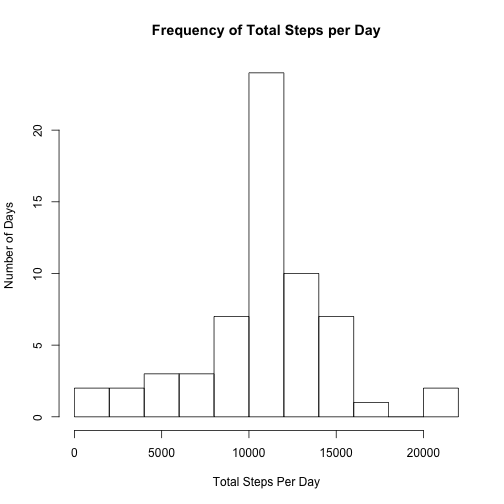
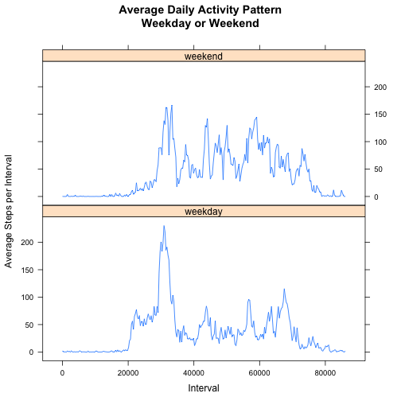

This assignment makes use of data from a personal activity monitoring device. This device collects data at 5 minute intervals throughout the day. The data consists of two months of data from an anonymous individual collected during the months of October and November 2012, and includes the number of steps taken in 5 minute intervals each day.

## Data

The data for this assignment can be downloaded from the course web site:

- Dataset: [Activity monitoring data [52K]](https://d396qusza40orc.cloudfront.net/repdata/data/activity.zip)

The variables included in this dataset are:

- steps: Number of steps taking in a 5-minute interval (missing values are coded as NA)
- date: The date on which the measurement was taken in YYYY-MM-DD format
- interval: Identifier for the 5-minute interval in which measurement was taken

The dataset is stored in a comma-separated-value (CSV) file and there are a total of 17,568 observations in this dataset.

## Loading and preprocessing the data


We're going to use libraries dplyr, stringr and sqldf for our data processing:

```r
library(dplyr)
library(stringr)
library(sqldf)
library(lubridate)
library(lattice)
```

The following code downloads, unzips, and loads the data file into a data frame:


```r
## the name of the dataset file
data_file <- "activity.csv"

## download dataset file if not already done so
if (!file.exists(data_file)) {
        ## check OS
        is_windows <- .Platform$OS.type == "windows"
        ## download the dataset
        download.file(url = "https://d396qusza40orc.cloudfront.net/repdata/data/activity.zip", 
                      destfile = "activity.zip",
                      method = ifelse(is_windows, "auto", "curl"))
        ## unzip the dataset archive
        unzip(zipfile = "activity.zip", files = data_file)
}

## read the entire dateset
rawdata <- read.csv(file = data_file, colClasses = c("integer", "Date", "character"))

## take a look at the first 10 rows
head(rawdata, n = 10)
```

```
##    steps       date interval
## 1     NA 2012-10-01        0
## 2     NA 2012-10-01        5
## 3     NA 2012-10-01       10
## 4     NA 2012-10-01       15
## 5     NA 2012-10-01       20
## 6     NA 2012-10-01       25
## 7     NA 2012-10-01       30
## 8     NA 2012-10-01       35
## 9     NA 2012-10-01       40
## 10    NA 2012-10-01       45
```

When looking at the values of the column 'interval' we can observe that they are numerical with a certain pattern:
```
0, 5, 10, 15, 20, 25, 30, 35, 40, 45, 50, 55, 100...
```
The pattern seems as follows: every twelve values perform a step of 100: 
```
0, 5, ..., 100, 105, ..., 200, 205, etc.  
```
This lets us conclude that the values represent the time of the day:
```
0 for 0:00h, 5 for 0:05h, ..., 100 for 1:00h, 105 for 1:05h, etc.
```
Following this pattern we can transform the values to datetime format:


```r
## create a function that will transform an interval string into a datetime using '1970-01-01' as a dummy date,
## and the transformed time of the column interval
interval_to_datetime <- function(interv) {
        sapply(interv, function(interv) {
                # fill the interval string with zeros and split in 4 characters
                digits = strsplit(str_pad(interv, 4, pad = "0"),"")[[1]]

                # create a time string in the format XX:XX:XX
                t_string = paste0(paste(digits[1:2], collapse = ""), ":", paste(digits[3:4], collapse = ""), ":00")

                # convert the time string into a datetime object
                dt = as.POSIXct(strptime(paste("1970-01-01", t_string), "%Y-%m-%d %H:%M:%S", tz = "GMT"))

                # return the result
                return(dt)
        })
}

## add the new column using the function interval_to_datetime
activity <- mutate(tbl_df(rawdata), interv_time = interval_to_datetime(interval))
```

## What is the mean total number of steps taken per day?

1. Calculate the total number of steps taken per day


```r
total_steps_by_day <- 
        activity %>%
        na.omit %>%
        group_by(date) %>% 
        summarise(steps = sum(steps))
```

2. Make a histogram of the total number of steps taken each day


```r
hist(total_steps_by_day$steps, xlab = "Total Steps Per Day", ylab = "Number of Days", breaks = 10,
     main = "Frequency of Total Steps per Day")
```

 

3. Calculate and report the mean and median of the total number of steps taken per day


- The mean of the total number of steps taken per days is 10766.19.
- The median of the total number of steps taken per days is 10765.

## What is the average daily activity pattern?

1. Make a time series plot (i.e. type = "l") of the 5-minute interval (x-axis) and the average number of steps taken, averaged across all days (y-axis)


```r
avg_steps_per_interval <- 
        activity %>% 
        na.omit %>%
        group_by(interv_time) %>% 
        summarise(avg_steps = mean(steps))

plot(avg_steps_per_interval$interv_time, avg_steps_per_interval$avg_steps, type = "l", 
     xlab = "Interval", ylab = "Average Steps per Interval", main = "Average Daily Activity Pattern")
```

 

2. Which 5-minute interval, on average across all the days in the dataset, contains the maximum number of steps?


The 5-minute interval at 08:35 contains the maximum number of steps on average accross all the days in the dataset.

## Imputing missing values

1. Calculate and report the total number of missing values in the dataset (i.e. the total number of rows with NAs)


```r
## check data for NA values
na_steps <- sum(is.na(activity$steps))
na_dates <- sum(is.na(activity$date))
na_intervals <- sum(is.na(activity$interval))
```

We have 2304 NA values for steps, no NA values for dates, and no NA values for intervals.

2. Devise a strategy for filling in all of the missing values in the dataset. The strategy does not need to be sophisticated. For example, you could use the mean/median for that day, or the mean for that 5-minute interval, etc.

The mean for the 5-minute interval across the other days where the data is hopefully not missing seems appropriate.

3. Create a new dataset that is equal to the original dataset but with the missing data filled in.

We're going to use the average steps data frame we calculate above to assign the steps values from that data frame to the steps where the value is NA


```r
activity_imp <- 
        sqldf('SELECT act.*, avg.avg_steps FROM "avg_steps_per_interval" as avg
              JOIN "activity" as act ON act.interv_time = avg.interv_time
              ORDER BY act.date, act.interv_time') 

activity_imp$steps[is.na(activity_imp$steps)] <- activity_imp$avg_steps[is.na(activity_imp$steps)]
activity_imp$avg_steps <- NULL
```

4. Make a histogram of the total number of steps taken each day and Calculate and report the mean and median total number of steps taken per day. Do these values differ from the estimates from the first part of the assignment? What is the impact of imputing missing data on the estimates of the total daily number of steps?


```r
## Calculate the total number of steps taken per day from the data frame with imputed values
total_steps_by_day <- 
        activity_imp %>%
        group_by(date) %>% 
        summarise(steps = sum(steps))

hist(total_steps_by_day$steps, xlab = "Total Steps Per Day", ylab = "Number of Days", breaks = 10,
     main = "Frequency of Total Steps per Day")
```

 

Calculate and report the mean and median total number of steps taken per day:


- The mean of the total number of steps taken per days is 10766.19.
- The median of the total number of steps taken per days is 10766.19.

The mean and median values are almost exactly equal as the values calculated before imputing missing values.
The histogram shows higher step frequency counts. 
The chosen strategy didn't change the mean and median values as expected since the imputed values were mean values themselves. The histogram shape didn't change, but the step frequency increased as one would expect since more values are available in the data frame.


## Are there differences in activity patterns between weekdays and weekends?

For this part the weekdays() function may be of some help here. Use the dataset with the filled-in missing values for this part.

1. Create a new factor variable in the dataset with two levels – “weekday” and “weekend” indicating whether a given date is a weekday or weekend day.


```r
weekdays <- function(x) {
        weekX <- ifelse(wday(x, label = T, abbr = T) %in% c("Sat", "Sun"), "weekend", "weekday")
        return(as.factor(weekX))
}
activity_imp$weekdays <- sapply(activity_imp$date, weekdays)
```

2. Make a panel plot containing a time series plot (i.e. type = "l") of the 5-minute interval (x-axis) and the average number of steps taken, averaged across all weekday days or weekend days (y-axis). See the README file in the GitHub repository to see an example of what this plot should look like using simulated data.


```r
avg_steps_per_interval <- 
        activity_imp %>% 
        group_by(interv_time, weekdays) %>% 
        summarise(avg_steps = mean(steps))

xyplot(avg_steps ~ interv_time | weekdays, data = avg_steps_per_interval, type = 'l', layout = c(1, 2),
       xlab = "Interval", ylab = "Average Steps per Interval", main = "Average Daily Activity Pattern\nWeekday or Weekend")
```

 


